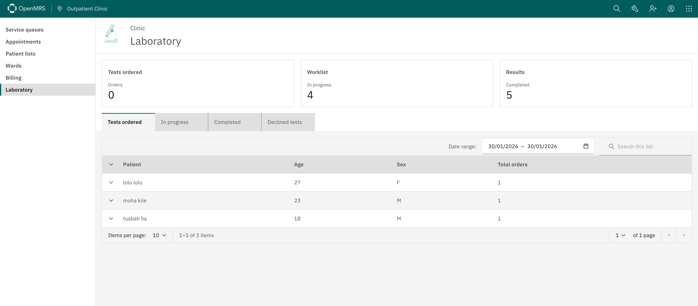
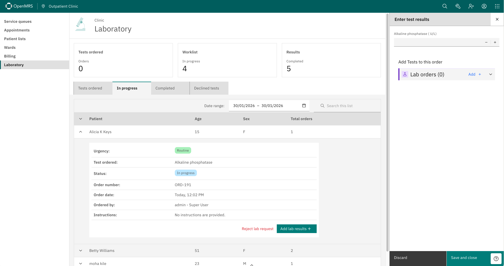

# openmrs-esm-laboratory-app

An O3 frontend module for managing laboratory requests and queues.

For more information, please refer to the [O3 Frontend Documentation](https://o3-docs.openmrs.org/).

## Dashboard



## Adding results

Lab technicians can enter test results by expanding an in-progress order and clicking "Add lab results". This opens a workspace where results can be recorded for each test.



## Customizing tab panels and summary tiles

Implementers can add or remove laboratory tab panels and summary tiles via extension configuration in the [routes.json](https://github.com/openmrs/openmrs-esm-laboratory-app/blob/main/src/routes.json) file.

## Configuration

The module supports the following configuration options:

| Property | Type | Default | Description |
| --- | --- | --- | --- |
| `laboratoryOrderTypeUuid` | `string` | `52a447d3-a64a-11e3-9aeb-50e549534c5e` | UUID for the laboratory order type |
| `labTableColumns` | `Array<string>` | `['name', 'age', 'sex', 'totalOrders', 'action']` | Columns to display in the lab table. Allowed values: `name`, `age`, `dob`, `sex`, `totalOrders`, `action`, `patientId` |
| `patientIdIdentifierTypeUuid` | `UUID` | `05a29f94-c0ed-11e2-94be-8c13b969e334` | Identifier type UUID for the patient ID column. Only needed if `patientId` is included in `labTableColumns` |
| `enableReviewingLabResultsBeforeApproval` | `boolean` | `false` | When enabled, lab results are submitted for review before being approved and finalized |

## Getting Started

```sh
# Clone the repository
git clone git@github.com:openmrs/openmrs-esm-laboratory-app.git

# Install dependencies
yarn

# Run the dev server
yarn start

# Or start on a specified port, e.g. 5000
yarn start --port 5000
```

Once it is running, a browser window should open with O3 running. Log in and then navigate to `/openmrs/spa/home/laboratory`.

## Running tests

```sh
yarn test
```
