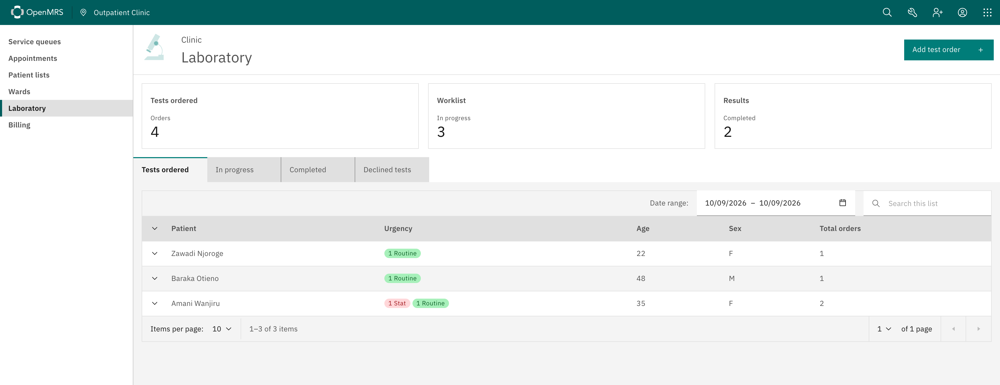
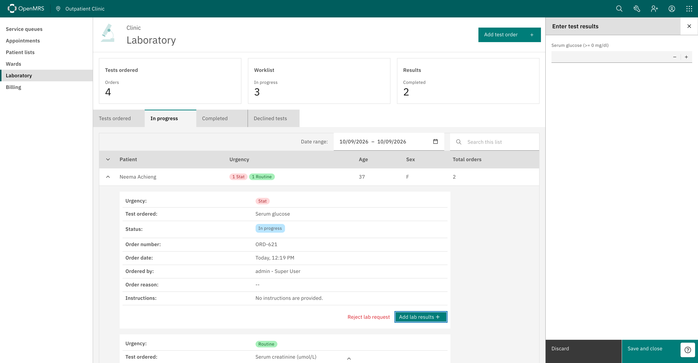

# openmrs-esm-laboratory-app

An O3 frontend module for managing laboratory requests and queues. It adds a **Laboratory** dashboard to the home page where lab staff can see incoming test orders, pick them up, record results, reject requests, and (optionally) review results before they are finalised.

For more information, please refer to the [O3 Frontend Documentation](https://o3-docs.openmrs.org/).

## Dashboard



The dashboard lives at `/openmrs/spa/home/laboratory` and has three parts:

- **Summary tiles** showing counts of ordered tests, tests in progress (the worklist), and completed tests. A **Pending review** tile is added when `enableReviewingLabResultsBeforeApproval` is on.
- **Tab panels**, one per stage of the lab workflow. Each panel lists orders grouped by patient; expanding a row shows the individual orders and the actions available for them.
- A **date range filter** and search box on each panel. The date range defaults to today and is shared across all panels.

| Tab | Shows orders whose fulfiller status is |
| --- | --- |
| Tests ordered | Not yet set (new orders that nobody has picked up) |
| In progress | `IN_PROGRESS` |
| Pending review | `DRAFT` (only shown when `enableReviewingLabResultsBeforeApproval` is on) |
| Completed | `COMPLETED` |
| Declined tests | `DECLINED` |

## Lab workflow

- **Add test order.** The button in the page header opens a patient search. Picking a patient with an active visit opens the order basket, restricted to the configured lab order type. Patients without an active visit are prompted to start one first.
- **Pick lab request.** From the *Tests ordered* tab. Moves the order to `IN_PROGRESS` and onto the worklist.
- **Add lab results.** From the *In progress* tab. Opens the test results workspace where a result can be recorded for each test in the order. More tests can be added to the order from the same workspace.
- **Reject lab request.** From the *Tests ordered* or *In progress* tabs. Asks for a fulfiller comment and moves the order to `DECLINED`. The comment is shown as the reason for decline in the *Declined tests* tab.
- **Approve / Amend lab results.** From the *Pending review* tab, when the review step is enabled. Approving moves the order to `COMPLETED` and makes the results available to clinicians. Amending reopens the results form.



## Configuration

The module supports the following configuration options:

| Property | Type | Default | Description |
| --- | --- | --- | --- |
| `laboratoryOrderTypeUuid` | `string` | `52a447d3-a64a-11e3-9aeb-50e549534c5e` | UUID of the order type treated as a lab order. Used to fetch orders and to filter the order basket when adding a test order |
| `labTableColumns` | `Array<string>` | `['name', 'urgency', 'age', 'sex', 'totalOrders', 'action']` | Columns to display in the lab table, in order. Allowed values: `name`, `urgency`, `age`, `dob`, `sex`, `totalOrders`, `action`, `patientId` |
| `patientIdIdentifierTypeUuid` | `UUID` | `05a29f94-c0ed-11e2-94be-8c13b969e334` (OpenMRS ID) | Identifier type shown in the `patientId` column. Only needed if `patientId` is included in `labTableColumns` |
| `usePreferredPatientIdentifier` | `boolean` | `true` | When `true`, the `patientId` column only shows an identifier that is both preferred and of the configured type. When `false`, any identifier of the configured type is shown, falling back to the patient's preferred identifier of any type |
| `enableReviewingLabResultsBeforeApproval` | `boolean` | `false` | Adds a review step. Shows the *Pending review* tab and tile and the approve/amend actions, so results are held for review before being finalised |

Example:

```json
{
  "@openmrs/esm-laboratory-app": {
    "labTableColumns": ["name", "patientId", "urgency", "age", "sex", "totalOrders", "action"],
    "enableReviewingLabResultsBeforeApproval": true
  }
}
```

## Customizing tab panels, summary tiles and actions

Panels, tiles and the action buttons are all extensions, so implementers can add, remove or reorder them with the standard [`extensionSlots` configuration](https://o3-docs.openmrs.org/en-US/docs/extension-system/#extension-configurability) without changing this module. The slots this module renders are:

| Slot | What goes in it |
| --- | --- |
| `lab-tiles-slot` | Summary tiles at the top of the dashboard |
| `lab-panels-slot` | Tab panels. Extensions must declare `meta.name` and `meta.title` (the tab label) to be shown |
| `tests-ordered-actions-slot`, `rejected-ordered-actions-slot` | Actions for new orders (pick up, reject) |
| `inprogress-tests-actions-slot` | Actions for in-progress orders (add results, reject) |
| `approved-ordered-actions-slot`, `amended-ordered-actions-slot` | Actions for orders pending review (approve, amend) |
| `completed-lab-order-results-slot` | Rendering of recorded results for completed orders and in the approval modal |

The extensions this module attaches to those slots, and their `order`, are listed in [routes.json](src/routes.json). For example, to hide the *Declined tests* tab:

```json
{
  "@openmrs/esm-laboratory-app": {
    "extensionSlots": {
      "lab-panels-slot": {
        "remove": ["declined-tile-component"]
      }
    }
  }
}
```

## Dependencies

This module reuses workspaces and modals from other O3 frontend modules, which must be present in the distribution:

- `@openmrs/esm-patient-orders-app` for the test results form and the order basket
- `@openmrs/esm-patient-tests-app` for adding lab orders and for the modal used to amend results
- `@openmrs/esm-patient-search-app` for the patient search when adding a test order
- `@openmrs/esm-patient-chart-app` for the start visit form

On the backend it needs the REST web services module (`webservices.rest` 2.2.0 or newer). Orders are read from the `order` resource and status changes go through the `order/{uuid}/fulfillerdetails` sub-resource.

## Getting Started

```sh
# Clone the repository
git clone git@github.com:openmrs/openmrs-esm-laboratory-app.git

# Install dependencies
yarn

# Run the dev server
yarn start

# Or start on a specified port, e.g. 5000
yarn start --port 5000

# Or proxy to a different backend (the default is https://dev3.openmrs.org/)
yarn start --backend http://localhost:8080/
```

Once it is running, a browser window should open with O3 running. Log in and then navigate to `/openmrs/spa/home/laboratory`.

Other useful scripts:

```sh
yarn verify              # lint, type-check and unit tests, as run in CI
yarn lint
yarn typescript
yarn build               # production build into dist/
yarn extract-translations
```

## Running tests

Unit tests use [Vitest](https://vitest.dev/):

```sh
yarn test
yarn test:watch
```

End-to-end tests use [Playwright](https://playwright.dev/). Copy `example.env` to `.env`, start the dev server, then run:

```sh
yarn test-e2e --headed
```

See the [E2E README](e2e/README.md) for details on the test structure, configuration and CI setup.

## Translations

Translations are managed in [Transifex](https://app.transifex.com/openmrs/openmrs3/). Only `translations/en.json` should be edited in this repository, and it is regenerated from the source code with `yarn extract-translations`. Other locales are pulled from Transifex automatically.

## Contributing

Pull requests are welcome. PR titles must follow the [OpenMRS conventional commit format](https://o3-docs.openmrs.org/en-US/docs/frontend-modules/contributing/#pull-requests), for example `(fix) O3-1234: Short description`. Before opening a PR, run `yarn verify` locally. See the [O3 contributing guide](https://o3-docs.openmrs.org/en-US/docs/frontend-modules/contributing/) for more.
